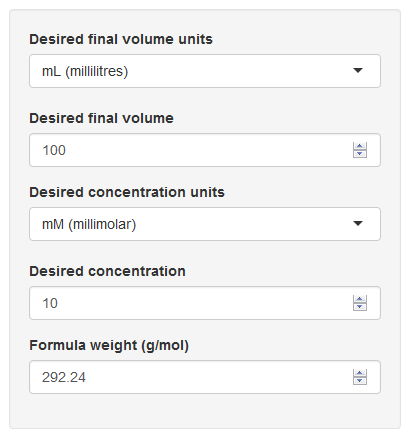
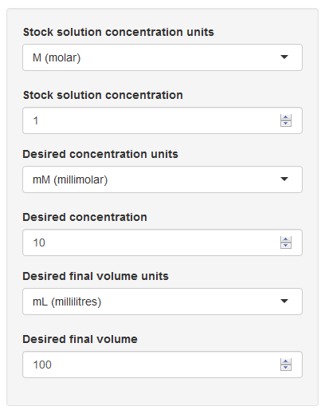

<!-- Limit image width and height -->
<style type='text/css'>
img {
    max-height: 625px;
    max-width: 964px;
}
</style>

<!-- Center image on slide 
<script src="http://ajax.aspnetcdn.com/ajax/jQuery/jquery-1.7.min.js"></script>
<script type='text/javascript'>
$(function() {
    $("p:has(img)").addClass('centered');
});
</script> -->

<!-- Center bold font -->
<style>
strong {
  font-weight: bold;
}
</style>

<!-- Center italic font -->
<style>
em {
  font-style: italic
}
</style>

## A simple calculator for use in the Biochemistry Lab 
<br>
Two everyday problems I and my colleagues encounter in the labroratory are:

1. How much of ***X*** do I need to weigh out to make a solution of concentration ***Y*** ?
2. How much of solution ***A*** do I need to dilute to make a soluton of concentration ***B*** ?

This is straightforward, but often requires converting units between different
scales.
<br>
<br>
So I have created a simple Shiny app to do these two calculations and convert the units, 
making things quicker and easier than pen and paper.
<br>
<br>
The app is at: <a href = "https://ab604.shinyapps.io/biochem_calculator", target="_blank">BioChem Calculator</a>
<br>
<br>
The R code is at: <a href = "https://github.com/ab604/biochem_calculator", target="_blank">GitHub Repo</a>

--- .class #id 

**For example** if I have a stock solution of <a href = "https://en.wikipedia.org/wiki/Ethylenediaminetetraacetic_acid", target="_blank">EDTA</a> at M1 = 0.5 Molar.
<br>
To make a volume V2 = 100 mL of EDTA at a concentration of M2 = 10 mM from the stock solution I need the concentration and volumes in the same units
to do the calculation, like so:

```r
# Input conc. and vols in Molar and Litres
M1 <- 0.5; M2 <- 10e-3; V2 <- 100e-3;
# Calcluate vol of stock needed in Litres
V1 <- (V2*M2)/M1; paste("vol. of stock needed", V1, "Litres");
```

```
## [1] "vol. of stock needed 0.002 Litres"
```

```r
# Convert back to millilitres
paste("vol. of stock needed", V1*1e3, "mL")
```

```
## [1] "vol. of stock needed 2 mL"
```

My Shiny app allows the user to choose the input and output units and do the 
conversion on the fly.

--- &twocol w1:30% w2:70%

## Mass Molarity Calculator

*** =left



$$Formula\,weight\,(g/mol) \times Desired\,vol.\,(L) \times Desired\,conc.\,(M) = Mass\,req.\,(g)$$

*** =right

This calculator calculates the dry mass of a substance in grams required to make up a solution to the desired volume and
<a href="https://en.wikipedia.org/wiki/Molar_concentration", target="_blank">molar concentration</a>.
<p>
The user selects the desired volume and molar concentration unit using the drop down tabs. They then enter the volume of solution, the concentration and the formula weight of the substance to be dissolved into the boxes. 
<p>
The mass required in grams is then calculated as:

--- &twocol w1:30% w2:70%

## Solution Dilution Calculator

*** =left



*** =right
This calculates the volume of stock concentrate required to achieve a specified volume and 
<a href="https://en.wikipedia.org/wiki/Molar_concentration", target="_blank">molar concentration</a>.
<p>
The user selects the stock solution concentraion units, the
desired concentration and volume units using the drop down tabs. 
They then enter the stock concentration, the desired concentration, and the desired volume of solution into the boxes. 
<p>
The volume of stock required is then calculated as:
$$\frac{Vol_{desired}\times Conc_{desired}}{Conc_{stock}} = Vol_{stock}$$

